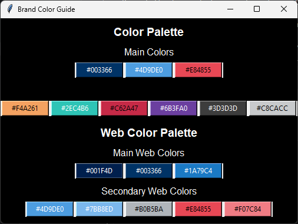

## Brand GUI Color Guide
This is for the person who has to constantly update the color scheme from the defaults every time they start a new project.  With this you can set your colors once and have them ready for you in an easy to understand GUI.  When you're ready to use them, click the color matched button and paste the value into whatever program you're working with.  The button automatically adds the Hex value to your clipboard.

<!--  -->
 


```
# Sample data structure for the GUI
data = {
    'Color Palette': {
        'Main Colors': ['#003366', '#4D9DE0', '#E84855'],
        '': ['#F4A261', '#2EC4B6', '#C62A47', '#6B3FA0', '#3D3D3D', '#C8CACC']
    },
    'Web Color Palette': {
        'Main Web Colors': ['#001F4D', '#003366', '#1A79C4'],
        'Secondary Web Colors': ['#4D9DE0', '#7BB8ED', '#B0B5BA', '#E84855', '#F07C84']
    }
}
```
<br>

**Customization**: \
The GUI is designed to adapt to your list.  If you need less colors simply delete the extras or comment the entire line out. \
*Example:*
```
# Sample data structure for the GUI
data = {
    'Color Palette': {
        'Main Colors': ['#003366', '#4D9DE0', '#E84855'],
        '': ['#F4A261', '#2EC4B6', '#C62A47', '#6B3FA0', '#3D3D3D', '#C8CACC']
    },
    # 'Web Color Palette': {
    #     'Main Web Colors': ['#001F4D', '#003366', '#1A79C4'],
    #     'Secondary Web Colors': ['#4D9DE0', '#7BB8ED', '#B0B5BA', '#E84855', '#F07C84']
    # }
}
```
 \
<br>
If you need additional colors just add them to the list.  You can create an entire new section or just add to the ones you already have. \
*Example:*
```
# Sample data structure for the GUI
data = {
    'Color Palette': {
        'Main Colors': ['#003366', '#4D9DE0', '#E84855'],
        '': ['#F4A261', '#2EC4B6', '#C62A47', '#6B3FA0', '#3D3D3D', '#C8CACC']
    },
    'Web Color Palette': {
        'Main Web Colors': ['#001F4D', '#003366', '#1A79C4'],
        'Secondary Web Colors': ['#4D9DE0', '#7BB8ED', '#B0B5BA', '#E84855', '#F07C84']
    },
    'MORE COLORS': {
        'Yes please!' : ['#FF6A00', '#59C43E', '#A81B40', '#430491', '#000000', '#FFFFFF', '#304DCC', '#EBDB50']
    },
}
```
 